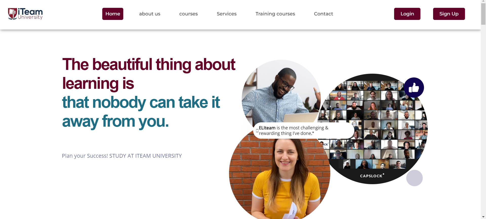
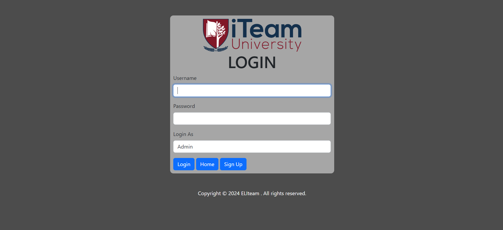
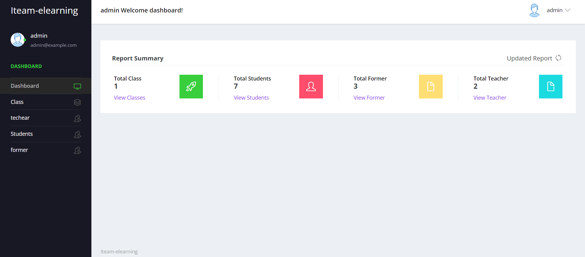

# Projet de Site E-learning

Bienvenue dans le projet de site ITeam e-learning développé en PHP. Ce projet a pour but de fournir une plateforme d'apprentissage en ligne où les utilisateurs peuvent accéder à divers cours et ressources pédagogiques.

## Table des matières

- [Introduction](#introduction)
- [Fonctionnalités](#fonctionnalités)
- [Prérequis](#prérequis)
- [Licence](#licence)

## Introduction

Ce projet est une plateforme e-learning
. Le projet utilise PHP pour le backend et HTML/CSS/js pour le frontend.

## Fonctionnalités

- Gestion des utilisateurs
- Inscription et authentification des utilisateurs
- Consultation des Cours en Ligne
- Formations en Ligne
- Tableau de bord pour les étudiants et les administrateurs

## Acteurs

- administrateur systéme : admin /mdp : admin123
- étudiant
- enseignant
- formateur

## Prérequis

Avant de commencer, assurez-vous d'avoir les éléments suivants installés :

- Serveur web (Apache, Nginx, etc.)
- MySQL
- Composer (pour la gestion des dépendances)

## Installation

1. Clonez le dépôt du projet :

   ```bash
   git clonehttps://github.com/Habibdrira/E-learning-plateforme.git
   ```

2. Importez le fichier de base de données `BD/elearn.sql` dans votre serveur MySQL.

Merci d'avoir consulté ce projet ! N'hésitez pas à me contacter pour toute question ou suggestion.




